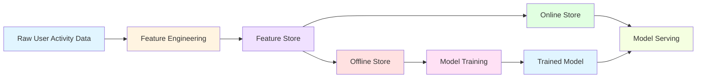

# Feature Store Project: User Activity Features


A professional demonstration of MLOps best practices using feature stores for machine learning. This project showcases feature engineering, centralized feature management, and the distinction between batch (training) and online (serving) feature retrieval patterns.

## Key Features

- **Feature Engineering Pipeline**: Transform raw user activity data into ML-ready features
- **Feature Store Simulation**: Demonstrates Feast feature store concepts and workflows
- **Batch & Online Serving**: Shows both training and real-time inference patterns
- **Production-Ready Code**: Clean, documented, and modular Python implementation
- **End-to-End Demo**: Complete working example from raw data to feature serving

## Architecture



The architecture demonstrates a typical ML feature store workflow:

1. **Raw Data**: User activity events (views, clicks, purchases)
2. **Feature Engineering**: Aggregate and transform raw data into features
3. **Feature Store**: Central repository for feature definitions and storage
4. **Offline Store**: Historical features for model training
5. **Online Store**: Low-latency features for real-time serving
6. **Model Training**: Use historical features to train ML models
7. **Model Serving**: Use online features for real-time predictions

## Installation

### Prerequisites

- Python 3.8 or higher
- pip package manager

### Setup

1. Clone the repository:
```bash
git clone <repository-url>
cd feature-store-project
```

2. Install dependencies:
```bash
pip install -r requirements.txt
```

## Quick Start

Run the complete demo to see feature engineering and feature store operations in action:

```bash
python src/examples/user_activity_demo.py
```

This will demonstrate:
- Feature engineering from raw user activity data
- Feature store initialization
- Historical feature retrieval for training
- Online feature retrieval for serving

## Usage Examples

### Feature Engineering

Transform raw user activity data into aggregated features:

```python
from src.feature_engineering import engineer_user_activity_features

# Raw user activity data
raw_data = {
    'user_id': [1, 1, 2, 2, 3],
    'activity_type': ['view', 'purchase', 'view', 'view', 'click'],
    'timestamp': [1704067200, 1704070800, 1704074400, 1704078000, 1704081600],
    'product_id': ['A', 'A', 'B', 'C', 'D']
}

# Engineer features
features_df = engineer_user_activity_features(raw_data)
print(features_df)
```

Output:
```
   user_id  total_activities  unique_products_viewed  purchase_count
0        1                 2                       1               1
1        2                 2                       2               0
2        3                 1                       0               0
```

### Feature Store Operations

#### Initialize Feature Store

```python
from src.feature_store_ops import initialize_feature_store, define_feature_view

# Initialize feature store
fs = initialize_feature_store()

# Define feature view
fv = define_feature_view()
print(f"Feature view: {fv['name']}")
print(f"Features: {[f['name'] for f in fv['features']]}")
```

#### Historical Features (Training)

```python
from src.feature_store_ops import simulate_historical_features
import pandas as pd
from datetime import datetime, timedelta

# Entity DataFrame with timestamps
entity_df = pd.DataFrame({
    'user_id': [1, 2, 3],
    'event_timestamp': pd.to_datetime([
        datetime.now() - timedelta(days=i) for i in range(3)
    ])
})

# Retrieve historical features
historical_features = simulate_historical_features(entity_df)
print(historical_features)
```

#### Online Features (Serving)

```python
from src.feature_store_ops import simulate_online_features

# Entity rows for real-time lookup
entity_rows = [
    {'user_id': 1},
    {'user_id': 2},
    {'user_id': 3}
]

# Retrieve online features
online_features = simulate_online_features(entity_rows)
print(online_features)
```

## Technologies Used

- **Python 3.8+**: Core programming language
- **Pandas**: Data manipulation and feature engineering
- **Feast**: Open-source feature store framework (simulated)
- **Type Hints**: Enhanced code clarity and IDE support

## Learning Outcomes

This project demonstrates understanding of:

- **MLOps Best Practices**: Feature store patterns, versioning, and reproducibility
- **Feature Engineering**: Transforming raw data into ML-ready features
- **Batch vs. Online Serving**: Different patterns for training and inference
- **Point-in-Time Correctness**: Ensuring training data integrity
- **Software Engineering**: Clean code, documentation, and modular design
- **Production ML Systems**: Scalable architecture for real-world applications

## Project Structure

```
feature-store-project/
├── README.md                          # This file
├── requirements.txt                   # Python dependencies
├── LICENSE                           # MIT License
├── .gitignore                        # Git ignore patterns
├── docs/                             # Additional documentation
│   ├── architecture.md               # Detailed architecture
│   ├── LINKEDIN_POST.md             # LinkedIn sharing template
│   └── images/                       # Diagrams and screenshots
├── src/                              # Source code
│   ├── __init__.py
│   ├── feature_engineering.py        # Feature engineering logic
│   ├── feature_store_ops.py         # Feature store operations
│   └── examples/                     # Usage examples
│       ├── __init__.py
│       └── user_activity_demo.py    # Complete demo
├── config/                           # Configuration files
│   └── feature_store_config.yaml    # Feature store settings
└── tests/                            # Test files
    └── __init__.py
```

## Contact & Links

- **LinkedIn**: [[Your LinkedIn Profile](https://www.linkedin.com/in/srinathkaithoju/)]


## License

This project is licensed under the MIT License - see the [LICENSE](LICENSE) file for details.

---

Built with ❤️ to demonstrate MLOps and feature store best practices
